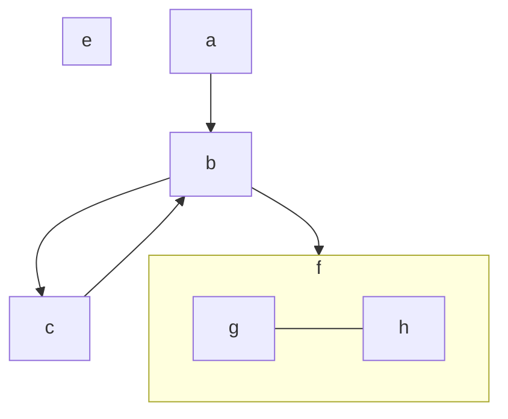

# Markdown and Mermaid

A test of [**Markdown**](https://www.markdownguide.org/basic-syntax/) and [**Mermaid**](https://mermaid.js.org/syntax/flowchart.html) support in Github

```mermaid
graph TD
    a-->b
    b-->c
    c-->b
    subgraph e
    end
    subgraph f
        g---h
    end
    b-->f

```
