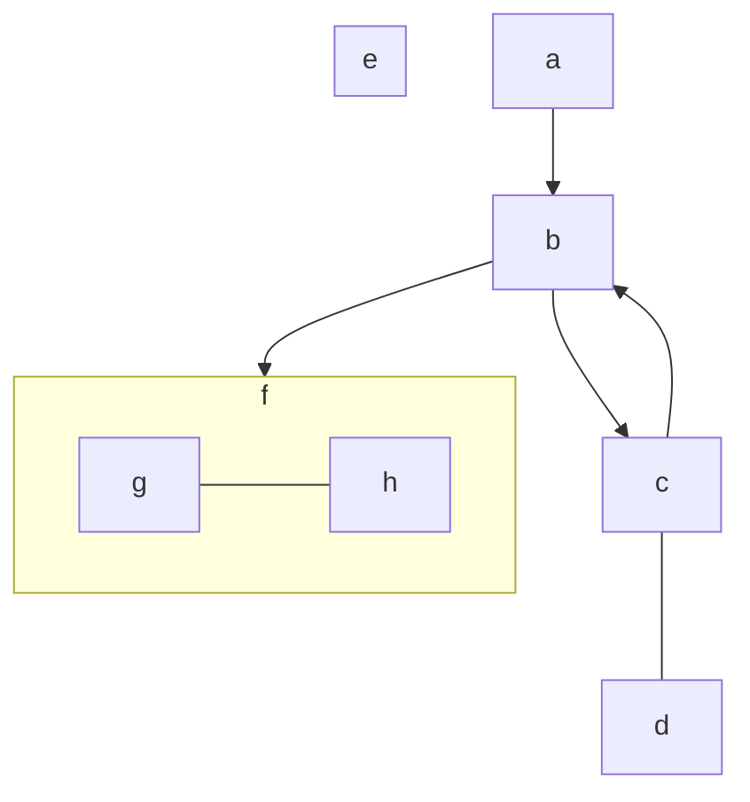
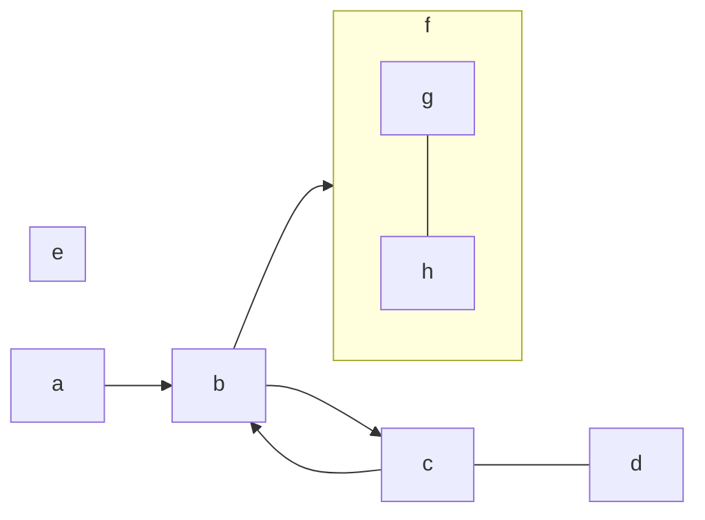
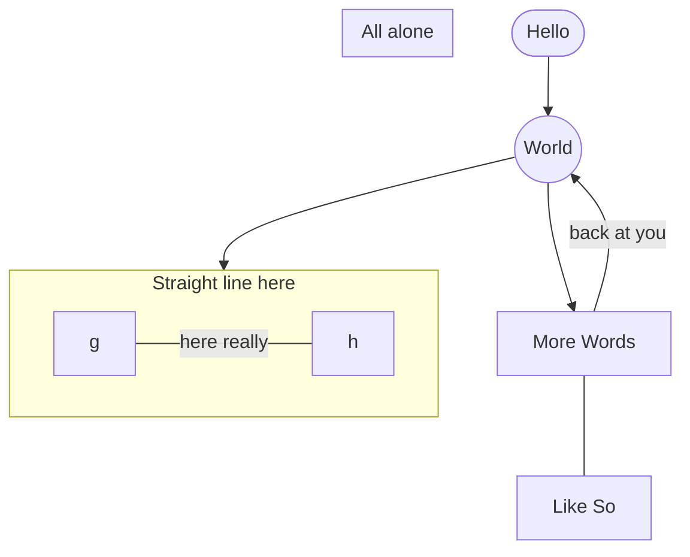

# Markdown and Mermaid

A test of [**Markdown**](https://www.markdownguide.org/basic-syntax/) and [**Mermaid**](https://mermaid.js.org/syntax/flowchart.html) support in Github

Same thing, but Left to Right (LR) instead of Top Down (TD):

A fancier version

Note I use the [MarkDown Viewer](https://github.com/simov/markdown-viewer) Chrome Extension to preview these files before pushing them to Github. It's a little tricky to setup but there are some instructions at that link. You need to [install it](https://chrome.google.com/webstore/detail/markdown-viewer/ckkdlimhmcjmikdlpkmbgfkaikojcbjk?hl=en) in Chrome, then maybe watch the video, but turn on Mermaid support and enable local file system access. Then open your file by going to **file:///Users/** in the Chrome address bar and locating it from there.